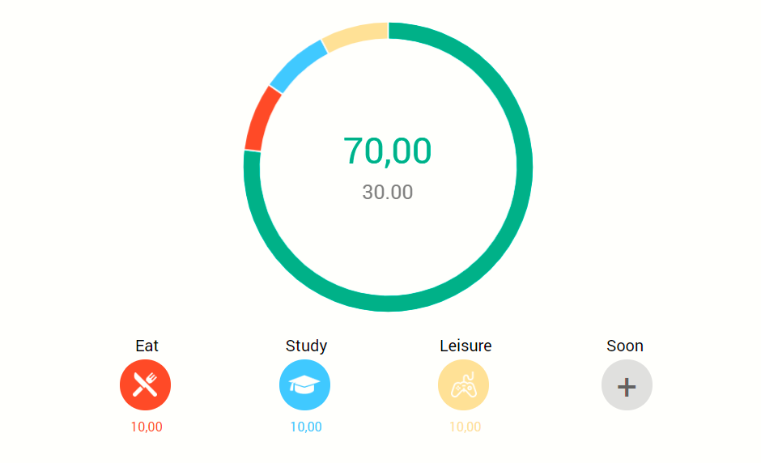

# Budget calculator

## Table of contents

* [Screenshots](#screenshots)
* [Technologies](#technologies)
* [Setup](#setup)
* [Features](#features)
* [Status](#status)
* [Inspiration](#inspiration)
* [Contact](#contact)


## Screenshots


## Technologies
* React, Redux, Redux Toolkit

## Setup
```javascript
npm i
npm start
```
## Code Examples

```javascript    
changeIncome: (state, action) => {
      state.income = action.payload;
      state.data[0] = action.payload;
      localStorage.setItem('data', JSON.stringify(state.data))
      localStorage.setItem('income', state.income)
    },
```

## Features
List of features ready and TODOs for future development
* save data afer refresh page 
* beautiful doughnut

To-do list:
* Customize items

## Status
Project is: _in progress_
I will improve and add new functionality for this project.

## Inspiration
Mini-project for my future projects.

## Contact
Created by [@filicaliva](https://www.linkedin.com/in/vfilimonchuk/) - feel free to contact me!